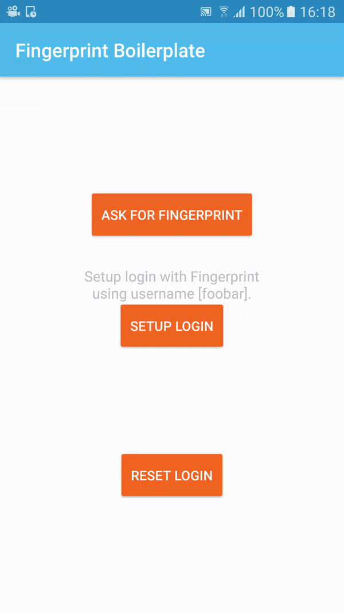

[](http://www.appcelerator.com/titanium/)
[](http://www.appcelerator.com/alloy/)
[](http://choosealicense.com/licenses/apache-2.0/)

# Axway Appcelerator Titanium Alloy Application Boilerplate for Apple Touch ID and Google Fingerprint implementation

This is a boilerplate for Apple Touch ID and Google Fingerprint implementation in your Ti Alloy application.

The idea is to have this as a sample and a boilerplate for building applications using those technologies.

iOS Demo           |  Android Demo
:-----------------:|:-------------------------:
  |  

## Dependancies (all included)

* [Ti.Identity](https://github.com/appcelerator-modules/titanium-identity)
* [ti.androidfingerprintalertdialog](https://github.com/adamtarmstrong/ti.androidfingerprintalertdialog) for Android Fingerprint Dialogs
* [Bencoding.Securely](https://github.com/benbahrenburg/Securely) to store login credentials securely on Android (replace Apple KeyChain)

## Requrements

* Ti SDK 6.3.0.GA+

## Usage

Once cloned, you can run `appc new --import --no-service` to initialise your `tiapp.xml` file with a valid app GUID.

Don't forget to add the following to your `tiapp.xml` too:

For iOS Touch ID, at the root of the file:

```xml
<property name="touchid.team_id" type="string">YOU_TEAM_ID</property>
```

This is so you can build and run this on iOS devices too.

`YOUR_TEAM_ID` can be found [here](https://developer.apple.com/account/#/membership) once logged in.

From there, you should be ready to build and test the boilerplate.

**Note:** For some reason, `Ti.Identity.isSupported()` always returns `false` on an Android Virtual Device but it works pretty well on a real device.

## Installation

Here I'm going to list down all the things you will want to have a look at while porting this boilerplate into your application.

### `tiapp.xml`

```xml
<android ...>
    <manifest ...>
        ...
        <!-- Fingerprint Permissions -->
        <uses-permission android:name="android.permission.USE_FINGERPRINT"/>
        ...
    </manifest>
</android>
```

```xml
<modules>
    <module platform="android" version="1.0.0">ti.identity</module>
    <module platform="android" version="3.1.0">bencoding.securely</module>
    <module platform="iphone" version="1.0.1">ti.identity</module>
</modules>
```

#### Install the required modules

* `ti.identity` for both iOS and Android.
* `bencoding.securely` for Android only.

#### Install the required Alloy assets

`ti.androidfingerprintalertdialog` Widget for Android only. Don't forget to add the dependancy to your `app/config.json` file.

Our FingerprintIdentity CommonJS library `lib/fingerprint-identity.js` is a wrapper to give you easy-to-use functions to call.

It also supports authentication capabilities if you're planning to use Touch ID or Fingerprint with a login functionality.

Initialise it in your `app/alloy.js`:

```js
// Init the library
var FingerprintIdentity = require("fingerprint-identity");
Alloy.Globals.fingerprintIdentity = new FingerprintIdentity();
```

`app/controllers/index.js` is a good example of what you can easily do with `fingerprint-identity`.

Our login setup example is what you could use with an API for example. You could ask for an access_token only valid for a fingerprint login.

Here we simply accept a password input but it would be exactly the same thing with an API call.

No matter what, we securely store it (the password or token) using either the iOS KeyChain or AES Encryption using `Bencoding.Securely` on Android.

## Resources

* [Ti.Identity](http://docs.appcelerator.com/platform/latest/#!/api/Modules.Identity)
* [Ti.Identity sources](https://github.com/appcelerator-modules/titanium-identity)
* [Ti.Identity.KeychainItem](http://docs.appcelerator.com/platform/latest/#!/api/Modules.Identity.KeychainItem)
* [Android Implentation Guide](https://medium.com/adamtarmstrong/https-medium-com-adamtarmstrong-android-fingerprint-authentication-using-axway-titanium-2c73a6c35df1)
* [Alloy Widget for Android Fingerprint UI](https://github.com/adamtarmstrong/ti.androidfingerprintalertdialog)
* [Bencoding.Securely](https://github.com/benbahrenburg/Securely)

## License

```
Copyright 2017 Cyber-Duck Ltd

Licensed under the Apache License, Version 2.0 (the "License");
you may not use this file except in compliance with the License.
You may obtain a copy of the License at

   http://www.apache.org/licenses/LICENSE-2.0

Unless required by applicable law or agreed to in writing, software
distributed under the License is distributed on an "AS IS" BASIS,
WITHOUT WARRANTIES OR CONDITIONS OF ANY KIND, either express or implied.
See the License for the specific language governing permissions and
limitations under the License.
```
